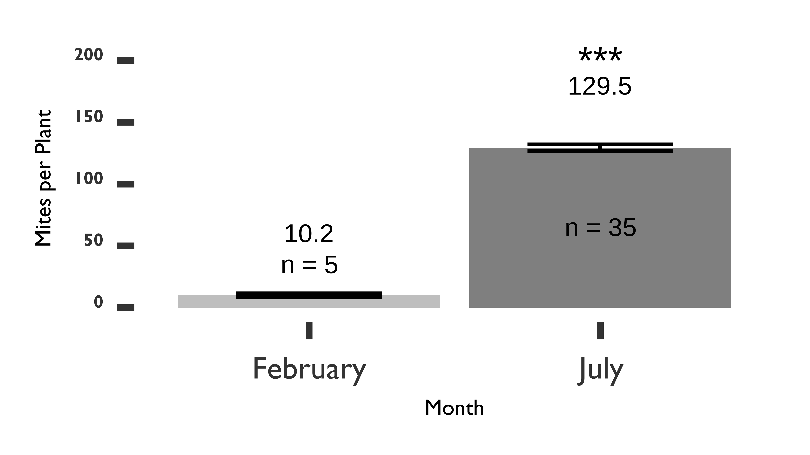

```{r global_options, include=FALSE}
knitr::opts_chunk$set(fig.width=12, fig.height=8, echo=FALSE)
```

```{r setup, include=FALSE}
knitr::opts_chunk$set(echo = FALSE)
#a list of packages used for scripts
pkgs <-
  c(
    'tidyverse',
    'sf',
    'lubridate',
    'ggplot2',
    'leaflet',
    'mapview',
    'htmlwidgets',
    'captioner',
    'ggthemes',
    'showtext',
    'extrafont',
    'Cairo',
    'writexl',
    "readxl"
  )

#installs missing packages
nu_pkgs <- pkgs[!(pkgs %in% installed.packages()[, "Package"])]
if (length(nu_pkgs))
  install.packages(nu_pkgs)

#loading required packages
lapply(pkgs, library, character.only = TRUE)
rm(pkgs, nu_pkgs)

# ####GETTING REQUIRED FONTS####
#telling R the path where the fonts are located
font_paths('fonts')

#imports the font Gill Sans MT as the font family 'gill_sans'
font_add(
  family = 'gill_sans',
  regular = "GIL_____.TTF",
  bold = "GILB____.TTF",
  italic = "GILBI___.TTF",
  bolditalic = "GILI____.TTF"
)

#imports the font Garamond MT as the font family 'garamond'
font_add(
  family = 'garamond',
  regular = "AGaramondPro-Regular.otf",
  bold = "AGaramondPro-Bold.otf",
  italic = "AGaramondPro-BoldItalic.otf",
  bolditalic = "AGaramondPro-Italic.otf"
)

# #uncommment and run to make sure it worked
# #it should list "gill_sans" and "garamond"
# font_families()

showtext_auto()


#setting up captions for use in the document
fig_nums <- captioner::captioner()

#allows me to use a custom function instead of the citation function of captioner, which is wordy to use
citef <- pryr::partial(fig_nums, display = "cite")

####MITE SURVEY ANALYSIS####

####READING IN THE REQUIRED FILES####
df <- read_xlsx('data/all_mites_survey.xlsx')

#making sure certain columns are considered as factors
df$p_fructiphilus <- as.factor(df$p_fructiphilus)
df$month <- month(df$date, label = TRUE, abbr = TRUE)

#focusing on mites in Florida
#filters out 'NAs'
df_fl <- filter(df, df$eriophyoids >= 0)

#filters out eriophyoids which aren't P. fructiphilus
df_fl <- filter(df_fl, df_fl$p_fructiphilus == 'Yes')

#filters data to only show Florida sites
df_fl <- filter(df_fl, df_fl$state == 'FL')

#filters data to only show Tallahassee
df_fl <- filter(df_fl, df_fl$county == 'Leon')

####DROPS A SPECIFIC SITE WHERE MITES COULD NOT BE VERIFIED####
df_fl <- filter(df_fl, df_fl$id != 'James 114')

#original sites
feb_sites <- filter(df_fl, df_fl$month == 'Feb')

#and the same sites from the second survey
j_1 <- filter(df_fl, df_fl$id == 'FSU 4')
j_2 <- filter(df_fl, df_fl$id == 'FSU 14')
j_3 <- filter(df_fl, df_fl$id == 'FSU 15')
j_4 <- filter(df_fl, df_fl$id == 'FSU 33')
j_5 <- filter(df_fl, df_fl$id == 'FSU 17')

#combining july sites
jul_sites <- bind_rows(j_1, j_2, j_3, j_4, j_5)

#t-test
p <-
  t.test(feb_sites$eriophyoids, jul_sites$eriophyoids, paired = T)
p
#cleanup
rm(df, feb_sites, j_1, j_2, j_3, j_4, j_5, jul_sites)

```

<u>Running head:</u>  
Scientific Notes  

<u>Membership status:</u>  
Member Xavier Martini (ID 1588)  

<u>Billing contact:</u>  
Xavier Martini
The University of Florida - North Florida Research and Education Center  
155 Research Road  
Quincy, 32351, USA  
Phone: +01 (850) 875-7160  
E-mail: xmartini\@ufl.edu  
Include any information (reference number, tax ID, etc.) that you need included on the invoice

**First report of *Phyllocoptes fructiphilus* in Florida**

Austin **Fife**^1^\*, Sam **Bolton**^2^, Mathews **Paret**^3^, and Xavier **Martini**^4^

^1^ University of Florida, Department of Entomology and Nematology, Gainesville, 
Florida, 32611, USA, E-mail: afife\@ufl.edu

^2^ The Florida Department of Agriculture and Consumer Services, Division of Plant Industry,  Gainesville, 
Florida, 32614, USA, E-mail: Samuel.Bolton\@FDACS.gov

^3^ University of Florida, Department of Entomology and Nematology, Gainesville, 
Florida, 32611, USA, E-mail: paret\@ufl.edu

^4^ University of Florida, Department of Entomology and Nematology, Gainesville, 
Florida, 32611, USA, E-mail: xmartini\@ufl.edu

*Corresponding author; E-mail: xmartini\@ufl.edu

\pagebreak
*Phyllocoptes fructiphilus* is a microscopic plant-feeding eriophyid mite. Eriophyoid mites are very host specific [@Skoracka2009; @Oldfield1996c]  and *P. fructiphilus* only feeds on plants in the genus *Rosa* [@Amrine1996]. *P. fructiphilus* is the vector of Rose Rosette Virus (RRV). RRV infection is commonly associated with the following symptoms: witches’ brooms/rosetting, deformed flowers, increased prickle density, elongated shoots, reddened leaves and stems, and increased die-back
which ultimately kills the rose host [@Amrine1996]. This disease is known as Rose Rosette Disease (RRD). and is the most serious disease of roses, creating millions of dollars of losses for growers. Rose Rosette Disease and the mite have invaded the southeastern united states as they followed the range expansion of the non-native *Rosa multiflora* (Thunb) towards the coast [@Amrine2002; @Otero-Colina2018].

RRD has been detected in Florida in 2014 on 15 plants; however, the plants were destroyed and *P. fructiphilus* were not detected on the roses at that time [@Babu2014].

In 2018 we began a series of surveys along the borders of northern Florida and southern Georgia.
Survey efforts initially focused on cities with populations over 1,000, including Leon, Gadsden and other counties in the surrounding regions. Rose tissue samples were taken from the periphery of various roses: samples included a mixture of flowers, fruits, buds and short lengths of rose cane, trimmed with bypass pruners and stored in quart sized plastic baggies. Pruners were sanitized with 70% ethanol between cuts. Rose species and coordinates were recorded to map out sites which had predatory mites, *P. fructiphilus*, or possibly RRD.

Samples were processed using a washing method derived from @Monfreda2007: cut roses were soaked in a 500 mL beaker with a solution of 1:1 bleach:water with few drops of dishwasher detergent. The solution was stirred vigorously with a glass rod to dislodge any mites. This solution was then poured over a stack of sieves with decreasing screen sizes: 180 &mu;m, 53 &mu;m and 25 &mu;m.
The beaker and rose pieces were further rinsed with tap water over the sieve stack to knock off any remaining mites. The 25 &mu;m sieve screen traps mites which are the size of *P. fructiphilus*. This sieve was then backwashed from the underside of the screen with a water-filled wash bottle, starting from the highest point of the sieve and working to the bottom of the sieve to flush the trapped debris into a 50 ml centrifuge tube for storage and future observation. Samples were observed under a dissecting microscope. Mites found among the plant debris were siphoned off with a glass pipette and subsequently stored in micro-centrifuge containers filled with 95% ethanol as a preservative. Select specimens were mounted directly into Hoyer's slide mountant (Hempstead Halide, Inc. Galveston, TX), dried at 90&deg;C, then ringed with nail polish. 

On February 14, 2019, we found a total of 42 eriophyid mites from six samples obtained while surveying roses in Leon County, Florida. (see *`r citef("sidemaps")`A*) The mites were sent to the Florida Department of Agriculture and Consumer Services - Department of Plant Industry (FDACS-DPI) and were all identified as *P. fructiphilus* using the keys provided in [@key_used]. The roses did not show signs or symptoms of RDD. These roses were tested for RRV with RT-qPCR and Reverse Transcription Recombinase Polymerase Amplification (RT-RPA) [@Babu2016; @Babu2017a]. However, none of the plants infested with *P. fructiphilus* were positive for RRV.

On July 16th we conducted an additional survey of 33 roses near the initial site of discovery, including the rose sites where P. fructiphilus were originally detected. (see *`r citef("sidemaps")`B*), Each sample contained more than 50 eriophyid mites, with some samples containing over 300 mites. We compared the samples collected during February and July with a paired t-test and we found a significant increase in *P. fructiphilus* population between the two sampling dates: p-value = 0.001, α = 0.05, df = 4. A subsample of these mites were slide mounted and subsequently confirmed as *P. fructiphilus*. Additional rose samples were tested for RRV by RT-qPCR, but no virus was detected.

This is the first record for *P. fructiphilus* in Florida. More importantly, RRV is currently not established in Florida. None of the mite-infested roses had symptoms of RRD and none were positive for RRV. However, the presence of *P. fructiphilus*, along with past detections of RRV in Florida warrants increased monitoring for the mite and virus in Florida. There is a critical need to develop methods to manage *P. fructiphilus* and RRV, or the US rose industry stands to lose millions on mite control.

Summary

The invasive mite *Phyllocoptes fructiphilus* (Acari: Trombidiformes, Eriophyidae) feeds on plants in the genus *Rosa* and is known as the primary vector of Rose Rosette Virus, the causal agent of Rose Rosette Disease (RRD) (Bunyavirales: Emaraviridae). The mite *P. fructiphilus* is reported for the first time in Florida, USA. No roses showed signs or symptoms of viral infection, and no virus was detected using molecular methods. *P. fructiphilus* represents a potential threat to the Florida rose industry if RRD becomes established.

Resumen  

El ácaro invasivo *Phyllocoptes fructiphilius* (Acari: Trombidiformes, Eriophyidae) se alimenta en plantas del género *Rosa* y es conocido principalmente como vector de la Virus Rosetón Rosal, el agente causal de la Enfermedad Rosetón Rosal (ERR) (Bunyavirales: Emaraviridae). El ácaro *P. fructiphilus* se reporta por la primera vez en Florida, USA. Ninguna rosa se mostró señales ni síntomas de infección viral, y ninguno virus fue detectado con métodos moleculares. *P. fructiphilus* se representa una amenaza potencial para la industria rosal Florideña si la ERR se establezca en Florida.

Key Words: Rose Rosette Disease; Rose Rosette Virus; Emaravirus

Acknowledgments: this research was supported by a grant awarded by the Florida Nursery, Growers and Landscape Association. We thank Jessie Griesheimer and James Brannin for assistance during the experiments. 


```{r, surveymaps, echo=FALSE}
####GRAPHING P. FRUCTIPHILUS LOCATIONS IN FLORIDA####
#makes the dataframe into a spatial dataframe
df_fl <-
  st_as_sf(df_fl,
           coords = c("longitude", "latitude"),
           crs = 4326)

####COMPARING POPULATIONS OVER TIME#####
#subsetting the data for different months to compare trends

#map for february
m_feb <-
  mapview(
    filter(df_fl, month == 'Feb'),
    col.regions = c("#B1B3B6", "#E28F41"),
    alpha.regions = 1,
    zcol = 'p_fructiphilus',
    layer.name = 'February',
    map.types = 'CartoDB.Positron'
  )

#map for july
m_jul <- mapview(
   filter(df_fl, month == 'Jul'),
  col.regions = c("#B1B3B6", "#E28F41"),
  alpha.regions = 1,
  zcol = 'p_fructiphilus',
  layer.name = 'July',
  map.types = 'CartoDB.Positron'
)

#a way to look at both maps at the same time
leafsync::sync(m_feb, m_jul, ncol = 2, no.initial.sync = F)
```

`r fig_nums(name = "sidemaps", caption = "Presence of *Phyllocoptes fructiphilus* in Leon County, Florida in (A) Feburary 2019 and (B) July 2019. Orange dots indicate sites sampled which had *P. fructiphilus*. Gray areas indicate previously surveyed areas where no *P. fructiphilus* were found.")`


```{r, graphs, echo=FALSE}
#

#makes a list of totals for each month to display on the graphs
df_fl <- df_fl %>% group_by(month) %>% mutate(
  totals = sum(eriophyoids),
  per_plant = mean(eriophyoids),
  sd = sd(eriophyoids),
  se = sd(eriophyoids) / sqrt(n()),
  totals = log(mean(eriophyoids)),
  se = log(sd(eriophyoids) / sqrt(n())),
) %>%
  ungroup()

df_fl$per_plant <- round(df_fl$per_plant, digits = 1)

#renaming columns for nicer graph titles on axes
df_fl <-
  rename(df_fl, Month = month, 'Mites per Plant' = per_plant)

#renaming months for better labels on graph
df_fl$Month <- month(df_fl$date, label = TRUE, abbr = FALSE)

####GRAPH####
ggplot(data = df_fl,
       mapping = aes(x = Month, y = `Mites per Plant`, fill = Month)) +
  geom_bar(stat = 'identity') +
  geom_errorbar(
    aes(ymin = `Mites per Plant` - se, ymax = `Mites per Plant` + se),
    width = 0.5,
    size = 2.5,
    position = position_dodge(.9)
  ) +
  coord_cartesian(ylim = c(-0.9, 210)) +
  geom_text(
    aes(Month, `Mites per Plant`, label = `Mites per Plant`, fill = NULL),
    size = 40,
    nudge_y = 50
  ) +
  geom_text(
    stat = "count",
    aes(label = paste0("n = ", ..count..), y = ..count..),
    size = 40,
    nudge_y = 30,
    data = df_fl
  ) +
  theme_tufte(base_size = 100, base_family = "gill_sans") +
  # ggtitle((expression(
  #   paste(
  #     "The Number of ",
  #     italic("P. fructiphilus"),
  #     " Found on Roses in Northern Florida"
  #   )
  # ))) +
  theme(legend.position = "none") +
  theme(
    plot.title = element_text(
      size = 100,
      face = "bold",
      hjust = 0.1,
      color = "grey20",
      family = "garamond"
    ),
    axis.text.x = element_text(
      color = "grey20",
      size = 140,
      angle = 0,
      hjust = .5,
      vjust = .5,
      face = "plain"
    ),
    axis.text.y = element_text(
      color = "grey20",
      size = 80,
      angle = 0,
      hjust = 1,
      vjust = 0,
      face = "bold"
    )
  ) +
  annotate(
    geom = "text",
    size = 60,
    x = 2,
    y = 200,
    label = "***",
    color = "black"
  ) +
  # annotate(
  #   geom = "text",
  #   size = 35,
  #   x = 2,
  #   y = 200,
  #   label = "p-value = 0.001",
  #   color = "black"
  # ) +
  scale_fill_manual(values = c("gray", "gray50"))  
  
# #saving the file
  # ggsave(
  #   'figure/survey_graph_pub.png',
  #   plot = last_plot(),
  #   type = "cairo",
  #   width = 16,
  #   height = 9,
  #   scale = 1,
  #   dpi = 300
  # )
```

`r fig_nums(name = "survey_graph", caption = "Log number of *Phyllocoptes fructiphilus* per rose sample. Samples were taken from sites in Leon County, Florida on February 14 and July 16th, 2019. Asterisks represent significant differences as calculated by pairwise t-tests of the 5 sites tested for *P. fructiphilus* during both months. α = 0.05, p-value = 0.001.")`

\pagebreak

**References Cited**